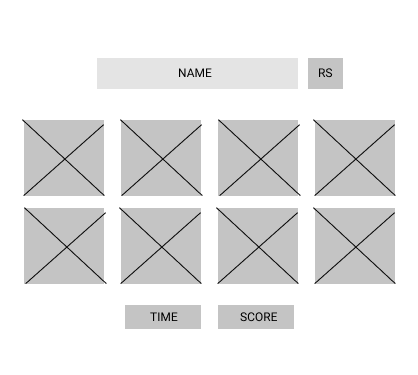
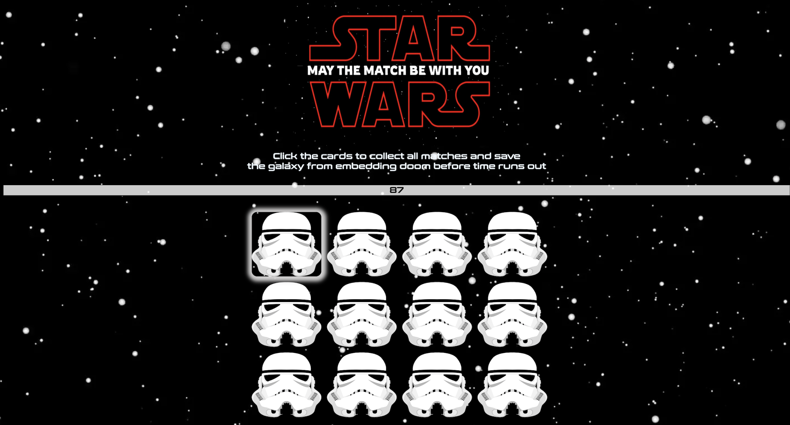

# Project_MemoryGame
<h6>The Game:</h6>
Match Wars is a game where you match the corresponding characters together before the time runs out and Darth Vader unleashes the the death star. Only you, Young jedi can save the galaxy from the embedding doom by matching all pairs.1 player can pick between 12 cards to match each pair before time runs out

<h6>Technologies:</h6>
HTML
CSS
Javascript

<h6>Where it started</h6> 

<h6>Episode 1: First iteration</h6>

<h6>Clink the link to start:  https://mefalloon.github.io/Memory-Game-Star-Wars-/</h6>

<h6>Next planned steps</h6>

<ul>Create a reset option</ul>
<ul>Alert User to lost game when timer runs</ul>
<ul>Create an intro with audio</ul>
<ul>add sounds to win/los alerts</ul>

